# Master Map

**Every note in this vault, and the shortest route to the one you want.** 🚀 The project is
finished and public. ⚠️ The merged student weights were **deleted on 2026-08-16**; start with
[[(Note) The Deleted Student Weights]] before running anything that loads a model.

```mermaid
flowchart TD
    MM["(Map) Master Map"] --> PS["(Report) Project Summary"]
    MM --> FI["(System) Flint Init"]
    MM --> HQ["(Guide) BRUNO HQ"]
    MM --> DEL["(Note) The Deleted Student Weights"]
    MM --> S00["00 Overview"]
    MM --> S10["10 Architecture"]
    MM --> S20["20 Codebase Map"]
    MM --> S30["30 Setup & Run"]
    MM --> S40["40 Data & Integrations"]
    MM --> S50["50 Decisions & ADRs"]
    MM --> S60["60 Roadmap, Tasks & Ideas"]
    MM --> S70["70 Ops, Deploy & Env"]
    MM --> S80["80 Testing & Quality"]
    MM --> S90["90 Reference"]
    MM --> AUD["(Report) Folder Audit"]
    MM --> INV["(Index) Complete File Inventory"]
    MM --> GAP["(Report) Gaps & Questions"]
    MM --> LOG["(Report) Build Log"]
    S00 --> W["What Distillation Is"]
    S00 --> H["Honest State"]
    S00 --> G["Git History"]
    S10 --> SA["System Architecture"]
    S10 --> TP["The Training Pipeline"]
    S10 --> EV["Evaluation and Scoring"]
    S20 --> ST["Source Tree"]
    S20 --> CH["Charts and Artefacts"]
    S30 --> IR["Install and Run"]
    S30 --> CS["Command Surface"]
    S40 --> CO["The Corpus and Splits"]
    S40 --> DEL
    S40 --> ES["External Services"]
    S50 --> LD["Locked Decisions and Amendments"]
    S60 --> RD["Roadmap and Owner Gates"]
    S70 --> CI["CI and Publication"]
    S70 --> EN["Environment Variables"]
    S80 --> TS["Test Suite"]
    S90 --> RR["Results Reference"]
    S90 --> TM["Teacher and Student Models"]
```

## Start here if you want to

| I want to | Open |
|---|---|
| Understand the project in one page | [[(Report) Project Summary]] |
| Know what was distilled from what | [[(Note) What Distillation Is]] · [[(Note) Teacher and Student Models]] |
| Know what got deleted and what it costs to rebuild | ⚠️ [[(Note) The Deleted Student Weights]] |
| Know what still runs today | [[(Note) Install and Run]] · [[(Note) The Deleted Student Weights]] |
| See the numbers | [[(Note) Results Reference]] |
| Know what is broken or unfinished | [[(Note) Honest State]] · [[(Report) Gaps & Questions]] |
| Understand the training run | [[(Note) The Training Pipeline]] |
| Understand how it was scored, and why that way | [[(Note) Evaluation and Scoring]] |
| Know where the data came from | [[(Note) The Corpus and Splits]] |
| Find a file | [[(Note) Source Tree]] · [[(Index) Complete File Inventory]] |
| Know why a decision was made | [[(Note) Locked Decisions and Amendments]] |
| Know what is left | [[(Note) Roadmap and Owner Gates]] |
| Audit this vault | [[(Report) Folder Audit]] · [[(Report) Build Log]] |

## Outline

**Top level**
[[(Report) Project Summary]] · [[(System) Flint Init]] · [[(Guide) BRUNO HQ]] ·
[[(Report) Folder Audit]] · [[(Index) Complete File Inventory]] ·
[[(Report) Gaps & Questions]] · [[(Report) Build Log]]

**Sections**
[[(Index) 00 Overview]] · [[(Index) 10 Architecture]] · [[(Index) 20 Codebase Map]] ·
[[(Index) 30 Setup & Run]] · [[(Index) 40 Data & Integrations]] ·
[[(Index) 50 Decisions & ADRs]] · [[(Index) 60 Roadmap, Tasks & Ideas]] ·
[[(Index) 70 Ops, Deploy & Env]] · [[(Index) 80 Testing & Quality]] ·
[[(Index) 90 Reference]]

**Plumbing**
[[(Index) Sources]] · [[(Note) Media]] · [[(Note) Exports]] ·
[[codebase-map-refresh]] · [[changelog-from-git]] · [[onboarding-guide]] · [[vault-audit]]

## Up

[[(Map) BRUNO HQ]] · [[(Guide) BRUNO HQ]]
