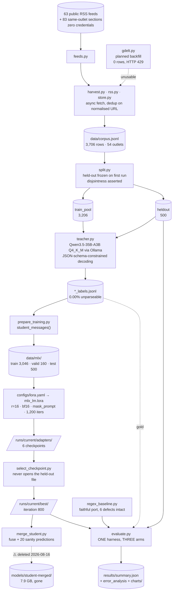

# System Architecture

**One module per pipeline stage, and the pipeline is a straight line with one join at the end.**
`src/reproduce.py` is the only file that knows the whole order, and it **deliberately never
trains**: training is launched explicitly, so no reproduction run can accidentally consume an
hour of GPU.

## The two decisions that do most of the work

### The contracts were frozen before any label existed

`src/schema.py` and `src/scoring.py` were written, tested and committed in **S1**, commit
`6363455`, in the sprint **before** the teacher was pulled. That is what stops a metric from
being chosen after its result is visible, and it is checkable: the commit predates every label
in the repo.

### Training and evaluation share exactly one prompt definition

`student_messages()` lives in `src/prepare_training.py`. `src/evaluate.py` **imports** it. There
is one definition, so training and evaluation cannot drift apart. This is a small thing that
prevents a whole category of silent, unfalsifiable error.

## Stage by stage

| Stage | Modules | What it produces |
|---|---|---|
| **Harvest** | `feeds.py`, `rss.py`, `harvest.py`, `store.py` | `data/corpus.jsonl`, 3,706 rows from 54 outlets. Async fetch, dedup on normalised URL |
| **Backfill that failed** | `gdelt.py` | **0 rows.** Kept deliberately: the code is correct and the failure is a rate-limit penalty box, so deleting it would lose the finding |
| **Split** | `split.py` | 3,206 train pool, 500 held out. **Membership is frozen on the first split rather than re-drawn**, so a background harvester that keeps adding rows can never leak into the evaluation set. Impossible by construction rather than by remembering the rule |
| **Label** | `teacher.py` | 3,706 labels at **0.00%** unparseable. JSON-schema-constrained decoding, temperature 0, `num_ctx` pinned to 2048 |
| **Prepare** | `prepare_training.py` | `data/mlx/{train,valid,test}.jsonl`, 3,046 / 160 / 500, each with a recorded SHA-256 |
| **Train** | `configs/lora.yaml` → `mlx_lm.lora` | Six checkpoints in `runs/current/adapters/` |
| **Select** | `select_checkpoint.py` | `runs/current/best/`, iteration 800. **The module cannot read the test set**, and it records that it did not |
| **Merge** | `merge_student.py` | ⚠️ `models/student-merged/`, deleted. Fuses, then asks for **20 sanity predictions** against the merged weights, because the merge is the step that could silently produce a valid-but-wrong model |
| **Evaluate** | `evaluate.py`, `error_analysis.py`, `measure_tokens.py`, `cost.py` | `results/summary.json` and everything downstream |
| **Record** | `record_run.py`, `stats.py`, `reproduce.py` | Provenance blocks, corpus receipts, and the seven-step reproduction order |
| **Chart** | `charts.py` + four `chart_*.py` | Five committed PNGs |

## `src/reproduce.py`, the seven steps

Token counts → run record → **checkpoint selection** → training curve → evaluation → error
analysis → confusion matrices.

Selection is a **pipeline step rather than a prerequisite**, so a fresh clone reproduces the
choice of checkpoint instead of inheriting it, and evaluation is pointed at `runs/current/best`
rather than at mlx-lm's final weights. `--dry-run` prints the pipeline without running it.
`--skip-student` loads no model, which is the variant that still works today.

## Related

[[(Note) The Training Pipeline]] · [[(Note) Evaluation and Scoring]] ·
[[(Note) The Corpus and Splits]] · [[(Note) Source Tree]] ·
[[(Note) The Deleted Student Weights]] · [[(Index) 10 Architecture]]
