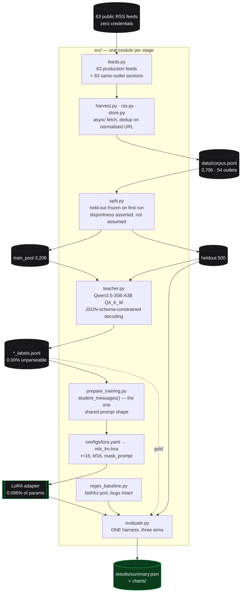

# distillation

**LoRA-distils a live production news classifier from a 35B open teacher into a 4B student, and
scores three arms — the incumbent regex, the teacher, the student — on 500 headlines held out
before a single label existed.**


```bash
uv sync
uv run python -m src.reproduce                  # regenerates every result and chart below
```

> **A 4B student agrees with its 35B teacher on 85.4% of held-out headlines — macro-F1 0.840 — at
> 41.3× lower list cost and 2.4× lower latency.** The keyword regex it would replace scores
> **0.337** on the same 500 and cannot emit the `consumer` class even once. The student beats it on
> every one of the eight classes on F1, and [loses to it on one](#where-the-student-loses).
> [Full table below](#results).

[](tests/)
[](pyproject.toml)
[](configs/lora.yaml)
[](masterplan.md#locked-decisions-do-not-relitigate)
[](LICENSE)

---

## Results

Held-out set, n=500, split before any label was generated and never trained on. Gold is the
teacher's own label. Every figure regenerates from [`results/summary.json`](results/summary.json)
and [`results/corpus_stats.json`](results/corpus_stats.json); the full protocol — corpus, split,
prompt, noise audit, and what it costs that gold is a model's opinion — is in
**[METHODOLOGY.md](./METHODOLOGY.md)**.

| Arm | Macro-F1 | Accuracy | p50 | p95 | Cost / 1k requests |
|---|---|---|---|---|---|
| **regex** (incumbent, in production today) | 0.3372 | 0.3420 | &lt;0.01 ms | 0.01 ms | $0.0000 |
| **teacher** · Qwen3.5-35B-A3B Q4_K_M | not scorable <sup>1</sup> | 84% <sup>2</sup> | 782 ms | 868 ms | $0.1547 |
| **student** · Qwen3.5-4B + LoRA r=16 | **0.8400** | **0.8540** <sup>3</sup> | **322 ms** | **403 ms** | **$0.0037** |

<sup>1</sup> **Gold *is* the teacher**, so scoring the teacher against gold returns 100% by
construction and means nothing. That figure is not reported anywhere in this repo.
<sup>2</sup> The teacher's estimated true accuracy is the **84% strict agreement** from a 50-example
hand audit ([`results/audit_50.md`](results/audit_50.md)), adjudicated before any student existed so
it could not be tuned to flatter one. 93% excluding the genuinely ambiguous cases.
<sup>3</sup> **The student's 85.4% and the teacher's 84% are not the same kind of number and must
not be read as the student beating the teacher.** 85.4% is agreement with the teacher's labels;
84% is the teacher's agreement with a human adjudicator. The student is trained on and scored
against the teacher, so the teacher's accuracy is a ceiling on the student's, not a rival figure.

**The trade-off, which is the actual deliverable:** the student keeps **85.4% agreement** with a
model 8× its size while costing **2.4%** as much per request and answering in **41%** of the time.
It was never tuned toward parity — chasing the last few points is an explicit non-goal — and no
attempt was made to beat the teacher.

Cost is **list-price arithmetic, not measured spend** — every arm ran locally on one Mac and cost
$0, and the rates are published serverless tiers applied to token counts measured over all 500
rendered prompts. Latency *is* genuinely measured: sequential, one request at a time, warm, with
warm-up calls discarded, all three arms through one harness on one machine.

### Where the student loses

The project's rule is that any class where the student loses to the incumbent leads the write-up
rather than getting buried. There is exactly one, and it is real but degenerate:

| | student | regex |
|---|---|---|
| `general` recall | 0.682 | **0.985** |
| `general` precision | **0.714** | 0.173 |
| `general` F1 | **0.698** | 0.295 |

**The regex catches 98.5% of true `general` headlines because it sends 75% of everything there.**
Its precision on the class is 0.173 — five of every six headlines it files under `general` belong
somewhere else. So the regex wins the recall column by refusing to make a decision, and the student
wins precision and F1 by a wide margin. It is reported because the rule says report it, not because
it is a defeat worth defending against.

The genuinely weak spot is elsewhere: **`consumer` recall is 0.529**. The student catches barely
half the consumer headlines, losing 7 of them to `tech` — *"Apple official refurb store: Save
hundreds on our top picks of the week"* reads as tech to a model that saw only ~190 consumer
training examples, the smallest class in the pool. AMENDMENT A1 predicted exactly this when the
corpus target was lowered, and said the cost would land on the tail classes. It did.

### Where the incumbent actually fails


Two things are visible at a glance and neither is subtle: the **`general` column is lit in every
single row**, and the **`consumer` column is completely empty**. 171 of 500 land on the diagonal.

This is the finding the project was built on, and it predates any student: **of the 375 held-out
headlines the regex files under `general`, the teacher moves 310 elsewhere — 82.7%.** The
incumbent's catch-all is wrong five times out of six, and the chart at the top of this page is that
pile broken down by where those headlines actually belong. Across the whole labelled corpus the
regex sends **74.2%** of headlines to `general`; the teacher sends 13.3%.

Per-class F1, both arms, from `results/summary.json`:

| Class | student F1 | regex F1 | delta | n |
|---|---|---|---|---|
| sports | **0.952** | 0.394 | +0.558 | 52 |
| geopolitics | **0.895** | 0.317 | +0.579 | 97 |
| science | **0.894** | 0.350 | +0.544 | 78 |
| finance | **0.871** | 0.486 | +0.386 | 51 |
| tech | **0.868** | 0.627 | +0.241 | 60 |
| entertainment | **0.862** | 0.229 | +0.633 | 62 |
| general | **0.698** | 0.295 | +0.403 | 66 |
| consumer | **0.679** | 0.000 | +0.679 | 34 |

**When the regex fires, it is usually right; it almost never fires.** Entertainment precision is a
perfect 1.000 on the eight headlines it claims, and it misses the other 54. The mirror image is
`general`: recall 0.985, precision 0.173 — it catches nearly every true `general` because it catches
nearly everything. The top five confusions are all the same confusion, `X → general`: geopolitics 78,
science 59, entertainment 50, sports 39, finance 31.

`consumer` is the one that is structurally impossible rather than merely hard. The rule exists in
production source, and it never fires once in 500 headlines, because `amazon` is matched by the tech
branch above it and `target` matches the verb. This is what a first-match-wins `if` chain does when
nobody re-reads it.

Head to head on the same 500: **the student is right where the regex is wrong 285 times; the regex
is right where the student is wrong 29 times.** Both sets are listed with verbatim headlines in
[`results/error_analysis.md`](results/error_analysis.md), the losing direction included.

### Where the student's errors are


**53.4% of the student's 73 errors involve the `general` catch-all** in one direction or the other —
and the S4 hand audit predicted this before a student existed. The audit found the teacher itself
routing US domestic politics to `general` sometimes and `geopolitics` other times, and identified
the cause: **the eight-class taxonomy inherited from the product has no `politics` class.**
`geopolitics` is defined as relations between states, `general` is the catch-all, and a story about
a Senate audit fits neither. The student inherited the wobble and is scored against it, so part of
that 53.4% is the taxonomy's fault rather than the model's. The full taxonomy by cause, with worked
examples, is in [`results/error_analysis.md`](results/error_analysis.md).

The rest is genuine cross-domain ambiguity of the kind the teacher also exhibits — *"Anthropic's $2
trillion problem: Its underlying business is nowhere near the IPO valuation it wants"* (gold `tech`,
student said `finance`), *"EJ Swift wins the 2026 Arthur C Clarke award for science fiction"* (gold
`entertainment`, student said `science`). These are headlines that honestly carry two labels; at
temperature 0.7 the teacher disagrees with *itself* on 14% of headlines for the same reason.

Agreement is flat across headline length (78.7% on 70–89 characters, 91.4% on 90+) and across outlet
volume (85.7% for high-volume outlets, 87.7% for low), so the model is not quietly leaning on a
length or prominence prior.

## What it does

Sentinel is a live iOS news-intelligence product. Every headline it ingests is sorted into one of
eight topic classes, and the thing doing the sorting is a keyword regex —
`classifyWireItem()` in the production backend. It is structurally broken in ways visible in its own
source, not inferred: the `if` chain returns on first match, so `"Amazon Prime Day"` is `tech`
rather than `consumer`, `"SpaceX launch"` is `tech` rather than `science`, and any headline
containing `china` is `geopolitics` forever.

This repo rebuilds that classifier's corpus from the same 63 public RSS feeds the product reads,
labels it with a 35B open-weight teacher running locally, LoRA fine-tunes a 4B open model on those
labels, and reports quality, cost and latency for all three arms on the same held-out 500.

Three properties make it a measurement rather than a demo. **The incumbent is an arm**, ported
faithfully with its six defects intact and each one pinned by a passing test, so a future "fix"
fails loudly — benchmarking only against the teacher would have been choosing the flattering
baseline. **The teacher is open-weight** (Qwen3.5-35B-A3B, Apache-2.0, run locally through Ollama),
which means the resulting student weights are publishable; training on a closed frontier model's
output and then shipping the weights would breach its terms. And **the corpus carries zero
credentials and zero user data** — it is rebuilt from public feeds rather than read out of the
product's database, so there is no privacy disclosure attached to it.

The stated deliverable is the trade-off curve, not parity. If the student reaches most of the
teacher's quality at a fraction of the cost, that is the result; tuning to close the last few points
is explicitly out of scope, and if the student loses to the regex on any class that leads the
write-up rather than getting buried.

The one thing that shaped every sprint boundary was **34 GB of free disk**, not RAM. The naïve
ordering needs 37 GB — 19 GB teacher plus 8 GB base plus 8 GB merged plus the environment — so the
plan is sequenced to delete the teacher before the student base model is pulled, which in turn is
why teacher latency had to be measured while the weights were still resident. It was: sequentially,
one request at a time, over the same held-out 500, never inferred from batched labelling throughput.

## Architecture



Two decisions do most of the work. **The label schema and the scoring function were frozen before a
single label existed** — `src/schema.py` and `src/scoring.py` were written and tested in the sprint
before the teacher was pulled, which is what stops a metric from being chosen after its result is
visible. Macro-F1 averages over **all eight** classes rather than the classes present in the data;
scikit-learn's default would have read 0.7222 on the S1 fixture against this implementation's
0.2708, and a distilled model silently dropping a tail class is exactly the failure this project
exists to surface. The scorer is ~60 lines written from first principles specifically so that choice
is visible in the repo rather than inherited from a library default.

**The student and the eval harness share one function.** `student_messages()` in
`src/prepare_training.py` produces the prompt shape, and `src/evaluate.py` imports it — training and
evaluation cannot drift apart, because there is only one definition to drift.

## How it was built

The full sprint log, with acceptance gates, as-shipped deltas and every decision's reasoning, is in
**[masterplan.md](./masterplan.md)**; the decision ledger is **[SYNC.md](./SYNC.md)**. Three things
in there are worth pulling out, because each changed the project rather than merely documenting it.

**The corpus plan died on contact with measurement, and the fix came from breadth.** The target was
5,500 headlines from repeat passes over 63 feeds. One pass yields ~1,800 unique; a second pass
fifteen minutes later yields **7**, because RSS feeds carry a rolling window that has not moved.
Volume comes from breadth or from hours, not from more passes. GDELT was the planned backfill and
turned out unusable on this network — one request succeeds, then every subsequent request returns
HTTP 429 regardless of spacing, verified at 20s and at 65s, contributing zero rows over 20 minutes.
`src/gdelt.py` is kept because the code is correct and the failure is a rate-limit penalty box
rather than a bug. What worked instead was section feeds drawn **only from outlets already in the
production catalog** — 86 candidates probed, 84 returned items, and the committed catalog carries
**83**, because one working candidate (`skysports.com`) was dropped solely for introducing an outlet
the product does not read. That rule is enforced by an `assert` in `src/feeds.py` and by a test,
not by discipline. It also fixed the tail-class problem at its source: the production catalog
carries 3 sports and 4 science feeds against 16 general. Final corpus **3,706 headlines from 54
live outlets**, and the target was formally lowered to 3,500 in an append-only amendment rather
than quietly missed.

**A probe designed to de-risk the model architecture caught an unrelated silent failure instead.**
The S5 sprint existed to check whether `mlx-lm` could LoRA-tune `Qwen3.5-4B` at all — it is a
multimodal `Qwen3_5ForConditionalGeneration` with hybrid linear/full attention. It could. But the
first adapter test returned `"Thinking Process:"` for all five cases — **0/5 valid classes** — which
reads exactly like a failed fine-tune. It was not. Qwen3.5-4B is a reasoning model whose chat
template opens a `<think>` block by default; mlx-lm renders *training* examples from the full
conversation and so produces a **closed, empty** one. Passing `enable_thinking=False` at inference
reproduces the training prefix byte-for-byte, and the same adapter scores **5/5 valid, 5/5 correct**.
Without that finding the student would have scored near zero in evaluation and the obvious reading —
"the fine-tune failed" — would have been completely wrong.

**Two measurements reversed decisions that had already been made.** The teacher was to be labelled
with a 32,768-token context; Ollama's default, on ~250-token prompts, drove a 48 GB machine into
7.7 GB of swap and took free disk from 12 GB to 4 GB mid-run. Pinning `num_ctx: 2048` stopped it,
and because that changed runtime configuration halfway through a dataset, 60 examples from the first
1,000 were re-labelled under the new setting: **60/60 identical**. Separately, the student was
originally to keep the teacher's full system prompt, on the reasoning that holding the prompt
constant kept the comparison clean. Tokenising both shapes showed **88% of every training example
was the same 262-token instruction block repeated 3,046 times**, projecting the run to ~10 hours
against a 1-hour cap. The deeper objection is that the original reasoning was backwards: a distilled
student is supposed to stop needing the instructions. Both arms still see identical *information* and
the identical held-out 500, so quality is unaffected — what changes is that the student stops paying
to re-read instructions it has already learned, which belongs in the cost table as a result rather
than being suppressed as a confound.

Alongside those, the teacher's own reliability was evidenced three ways rather than asserted:
100/100 unanimous at temperature 0, 60/60 identical across the context change, and **500/500
identical** when the latency run independently re-predicted the entire held-out set and reproduced
gold exactly.

**The training run had to be done twice, and the curve shows why the second one mattered.**


The first full run died at roughly iteration 1,170 of 1,200 in a macOS GPU-driver kernel panic and
took its stdout log with it, leaving the loss history unrecoverable. Resuming from a checkpoint
would have produced neither an uninterrupted run nor a curve that could be honestly plotted, so it
was retrained from scratch with the log written inside the repo where a reboot could not take it.

**The curve then paid for itself, and the finding is the most valuable thing in this sprint.** Loss
flattens by iteration 100 and sits at ~0.07 through iteration 900, then blows out over the last 200
iterations. Note *what* rises: validation loss goes 0.075 → 0.280, and mean **training** loss rises
with it, 0.072 → 0.26. That is not overfitting — overfitting drives training loss down while
validation climbs. Both moving together is an **optimisation excursion**, and the plain reading is
that 1,200 iterations was simply too many for this run.

So the shipped adapter is the **best-validation checkpoint, iteration 800**, not the final weights.
That choice is worth **+8.0 macro-F1 points**:

| adapter | macro-F1 | artifact |
|---|---|---|
| **iter 800** — best validation loss (0.075) | **0.8400** | [`results/summary.json`](results/summary.json) |
| iter 1200 — final weights, the default | 0.7599 | [`results/summary_final_checkpoint.json`](results/summary_final_checkpoint.json) |

Shipping mlx-lm's default final checkpoint would have thrown away a tenth of the model's quality.
Both evaluations are committed rather than only the flattering one.

**The selection used only the 160-example validation split carved from the training pool.** The
held-out 500 played no part in choosing the checkpoint — `src/select_checkpoint.py` never opens that
file and records so in `runs/current/best/selection.json`, alongside the full ranking of all six
checkpoints. Picking a checkpoint on the test set is the quiet way to leak it, and the guard here is
that the module cannot read it rather than that nobody remembered to.

Four report windows returned `nan` and are drawn as marked gaps rather than dropped, because a
silent hole in a loss curve should be impossible to miss. **Ten training batches recorded a loss of
exactly 0.0** — real, on a task where a batch of eight short single-token answers can genuinely be
predicted perfectly — and the plot is symlog rather than log so those points are visible at the
floor instead of being silently dropped by a log scale that cannot represent zero.

## Evidence

| Claim | Artifact |
|---|---|
| Regex macro-F1, per-class P/R/F1, confusion matrix | [`results/summary.json`](results/summary.json) |
| 3,706 labels at **0.00%** unparseable | [`results/corpus_stats.json`](results/corpus_stats.json) |
| Regex sends **74.2%** of the corpus to `general` | [`results/corpus_stats.json`](results/corpus_stats.json) |
| Teacher reassigns **310 of 375** regex-`general` held-out headlines | [`results/corpus_stats.json`](results/corpus_stats.json) |
| Teacher latency p50 782 ms · p95 868 ms, n=500 sequential | [`results/corpus_stats.json`](results/corpus_stats.json) |
| Teacher noise ceiling **84%** strict / 93% excluding ambiguous | [`results/audit_50.md`](results/audit_50.md) |
| Six incumbent defects, each pinned by a test | [`tests/test_regex_baseline.py`](tests/test_regex_baseline.py) |
| Macro-F1 averaging convention (0.2708, not the flattering 0.7222) | [`tests/test_scoring.py`](tests/test_scoring.py) |
| Base model pinned by revision SHA | [`configs/lora.yaml`](configs/lora.yaml) |
| Per-arm token counts, measured over all 500 held-out prompts | [`results/token_counts.json`](results/token_counts.json) |
| Cost arithmetic, line by line | [`src/cost.py`](src/cost.py) → [`results/summary.json`](results/summary.json) |
| Error taxonomy by cause, head-to-head, length and outlet-volume breakdowns | [`results/error_analysis.md`](results/error_analysis.md) |
| Checkpoint choice, its ranking, and that the held-out set was not used | [`runs/current/best/selection.json`](runs/current/best/selection.json) |
| The final-checkpoint evaluation, committed alongside the shipped one | [`results/summary_final_checkpoint.json`](results/summary_final_checkpoint.json) |
| 20/20 sanity predictions against the merged weights | [`results/sanity_20.json`](results/sanity_20.json) |
| Training hyperparameters, dataset hashes, pinned revision, git commit | [`runs/current/hyperparams.json`](runs/current/hyperparams.json) |
| Corpus, split protocol, prompt, noise audit, limitations | [`METHODOLOGY.md`](./METHODOLOGY.md) |
| Every sprint's acceptance gate, delta and deferral | [`masterplan.md`](./masterplan.md) |

`data/` is gitignored — it is large and fully regenerable from `src/harvest.py`. That is why
`src/stats.py` exists: it recomputes every corpus and teacher figure from the JSONL and writes them
into `results/corpus_stats.json`, so a reader checks a number against a file rather than against
prose.

### Cost

List price, not spend. The rates are published serverless tiers billed by parameter count, which is
the rare case where a price applies to a specific open model without guessing: **$0.10 / 1M tokens**
under 4B, **$0.50 / 1M tokens** for MoE up to 56B. Both are flat across input and output, so there
is no input/output split to argue about.

```
regex     $0.0000 / 1k requests   a pure function — no model, no tokens, no request
teacher   $0.1547 / 1k requests   (302.98 in +  6.51 out) × 1000 = 309,490 tokens × $0.50/1M
student   $0.0037 / 1k requests   ( 35.98 in +  1.51 out) × 1000 =  37,490 tokens × $0.10/1M

student is 2.42% of teacher cost — 41.3× cheaper
  = 5.0× price tier  ×  8.26× fewer tokens        (neither factor alone produces it)
```

Those token counts are measured, not assumed, and the measurement corrected the number. `src/cost.py`
originally carried four hardcoded constants; re-tokenising every one of the 500 held-out prompts
through each arm's real prompt builder
([`src/measure_tokens.py`](src/measure_tokens.py) → [`results/token_counts.json`](results/token_counts.json))
found all four wrong in both directions — the student's input was understated at 32 against a
measured **35.98**, and the teacher's output overstated at 10 against a measured **6.51**. The
published ratio moved from 45.4× to **41.3×**. `cost.py` now reads the artifact and raises if it is
missing, so it can no longer fall back to a constant.

**One caveat travels with the teacher figures.** The teacher's 22 GB of weights were deleted in S4
to reclaim disk, so its prompts are tokenised with the *student's* tokeniser — same Qwen family, but
not the same file. That is recorded in `results/token_counts.json` rather than left implicit.

41.3× is the optimistic read and the pessimistic one is reported beside it. Qwen3.5-4B is 4.21B
parameters, just over the sub-4B tier boundary; billed one tier up the price-tier factor disappears
and it is **8.3× cheaper**. Had the student kept the teacher's full prompt it would have been
**5.1×** — that gap is what [AMENDMENT A3](masterplan.md#amendments) bought.

## Usage

```bash
uv sync                                          # Python 3.12 + MLX. Not 3.14 — no ML wheels yet.
uv run pytest -q                                 # green, and run in CI on every push

uv run python -m src.harvest                     # rebuild the corpus from public RSS
uv run python -m src.split                       # held-out 500, frozen on first run

# Labelling needs the teacher pulled locally first:
#   ollama pull hf.co/unsloth/Qwen3.5-35B-A3B-GGUF:Q4_K_M    # 22 GB
uv run python -m src.teacher --input data/heldout.jsonl    --output data/heldout_labels.jsonl
uv run python -m src.teacher --input data/train_pool.jsonl --output data/train_labels.jsonl
uv run python -m src.teacher --latency --n 500             # sequential timing, before deletion
uv run python -m src.prepare_training            # → data/mlx/{train,valid,test}.jsonl

uv run mlx_lm.lora --config configs/lora.yaml    # LoRA r=16, bf16. Explicit — reproduce never trains.

uv run python -m src.reproduce                   # every result and chart, in dependency order
uv run python -m src.reproduce --dry-run         # print the pipeline without running it
uv run python -m src.stats                       # corpus + teacher receipts
```

`src.reproduce` runs seven steps in dependency order — token counts → run record → **checkpoint
selection** → training curve → evaluation → error analysis → confusion matrices — and deliberately
never trains; training is launched explicitly. Selection is a pipeline step rather than a
prerequisite, so a fresh clone reproduces the choice of checkpoint instead of inheriting it, and the
evaluation is pointed at `runs/current/best` rather than mlx-lm's final weights. `--skip-student` is
the variant that loads no model, for regenerating the regex and teacher rows on a machine without
the weights.

The harness prints one table for all three arms. Reproduced from
[`results/summary.json`](results/summary.json), which is what it writes:

```
arm         macro-F1  accuracy    p50 ms    p95 ms  invalid
regex         0.3372    0.3420       0.0       0.0        0
student       0.8400    0.8540     322.1     403.0        0
teacher          n/a       n/a     781.8     867.7        —

[eval] teacher quality is n/a by construction — see results/summary.json
```

**`invalid 0` on the student matters more than it looks.** Every one of its 500 outputs parsed to a
valid class with no coercion and no retry. That is the payoff of the S5 `enable_thinking=False`
finding — without it the same adapter emits reasoning prose and scores near zero.

## Limitations

**Gold labels come from a model, so student-vs-gold measures agreement with the teacher, not
correctness.** The hand audit puts the teacher's strict agreement with a human adjudicator at 84%,
and that is the ceiling — the student cannot be meaningfully more right than the labels it is
trained on and scored against. Both the 84% and the 93%-excluding-ambiguous figure are reported;
neither is rounded up.

**The taxonomy has no `politics` class, and this is an irreducible noise floor for every arm.** The
audit found the teacher routing US domestic politics to `general` sometimes and `geopolitics` other
times. That is not sloppiness: `geopolitics` is defined as relations between states, `general` is
the catch-all, and a story about a Senate audit or a state-level tax fits neither. Any labeller
wobbles across that boundary. **The student inherited it exactly as predicted:** `general` is its
worst class after `consumer` (F1 0.698), and 53.4% of its 73 errors involve `general` in one
direction or the other, with `geopolitics` the single largest destination. Part of that is the
taxonomy's fault rather than the model's, and no amount of training fixes it. It is also a real,
actionable finding for the product: the category set is missing a ninth class.

**The task forces one label onto headlines that carry two.** At temperature 0.7 the teacher
disagrees with itself on 14 of 100 headlines, and every disagreement inspected was genuine
multi-label ambiguity rather than noise — *"Micron: China probes US chip maker for cybersecurity
risk"* is honestly both geopolitics and tech. This is a soft ceiling on every arm.

**Two of fifty audited headlines carry no topical content at all** — newsletter titles like
*"HQ PM Newsletter 8/13/2026"*. The teacher can only fall back on the outlet, which is a legitimate
strategy that the student will also learn, but it means a slice of both arms' apparent accuracy is
outlet-prior rather than headline understanding.

**Scope.** Headline-only, no article body. English-only, despite the corpus including DW, France24,
NHK and SCMP. One narrow task, 8 classes, 500 held-out examples — the smallest held-out class has 34,
which is thin. The training set is ~3,200 rather than the planned ~5,000; AMENDMENT A1 said openly
that the cost of that would land on the tail classes, and it did — **`consumer`, the smallest class
at ~190 training examples, recalls only 0.529** against 0.86–0.94 for every well-populated class.
Feeds move, so the corpus is a snapshot of August 2026 rather than a stable benchmark.

**Cost is arithmetic, latency is measured.** Every arm ran locally at $0. The dollar figures are
published list prices applied to measured token counts, and are labelled as such in the code, in
`results/summary.json`, and here. Latency is genuinely measured by this repo's own monotonic timer
around single sequential requests, warm, with warm-up calls discarded — a cold first call costs
19.6 s against ~800 ms warm, and including that in p95 would measure the cost of starting a server
rather than of serving a request.

**One repeat, one machine, one seed.** The training run was not repeated, so there is no
run-to-run variance estimate on the student's 0.840, and the held-out set is a single 500-example
draw. Treat the third decimal place as noise.

## Status

**S0–S8 closed. All three arms are measured and written up.** Only S9 remains, and every task in it
is an owner gate.

Getting here took two training runs. The first died at roughly iteration 1,170 of 1,200 in a macOS
GPU-driver kernel panic and took its log with it; the second completed and is the one reported. The
evaluated adapter is the best-validation checkpoint (iteration 800), not the final weights —
worth +8.0 macro-F1 points, and chosen using only the validation split.

Every number in this README comes from a committed artifact and one command regenerates all of
them. `results/summary.json` carries a provenance block — base model, pinned revision SHA, adapter
SHA-256, held-out file hashes, git commit and a dirty flag — so no result traces back to an unknown
snapshot.

Nothing here is published. Every owner-gated action — pushing weights or the dataset to Hugging
Face, making the repo public, any paid compute — is batched into
[S9](masterplan.md#s9--all-owner-gates--nothing-here-runs-without-bruno) and none of it has been
requested or approved — `git-lfs` and `huggingface-cli` are still uninstalled, deliberately, because
installing them would be preparing for a gate that may be declined. S0–S8 ran without a single owner
gate interrupting them, which is what the plan asked for.

## License · Author

MIT — see [LICENSE](LICENSE). Model weights are not committed; the teacher and base models are
Apache-2.0 and are pulled by revision. Geist is vendored under SIL OFL-1.1.

Built by **Bruno Jaamaa** — [brunojaamaa.dev](https://brunojaamaa.dev) · [@br9704](https://github.com/br9704)
